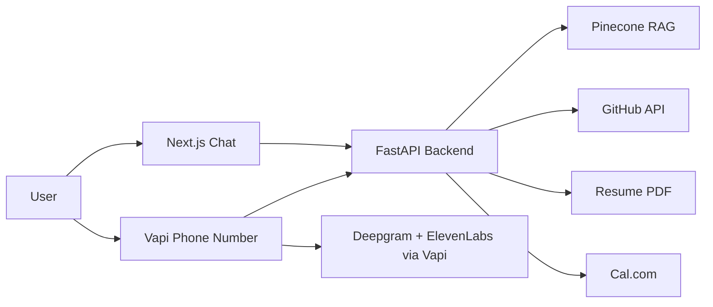

# AI Persona

An AI representative that can answer questions about a candidate, discuss GitHub work, expose real calendar availability, and book interviews through chat or voice.

## What This Repo Includes

- FastAPI backend for RAG, booking, and voice webhooks
- Next.js chat UI with in-chat booking support
- Vapi assistant configuration for phone calls
- Resume + GitHub ingestion into Pinecone
- Eval scripts for chat groundedness and voice quality

## Architecture



## Tech Stack

| Component | Technology |
|-----------|------------|
| Voice Agent | Vapi + Deepgram + ElevenLabs |
| Chat Backend | FastAPI + LangChain + Groq / NVIDIA / OpenAI (configurable chain) |
| Embeddings | NVIDIA NIM NeMo (2048-d) or ModelScope / OpenAI-compatible — must match Pinecone index |
| Chat Frontend | Next.js 14 + Tailwind CSS |
| Vector Store | Pinecone |
| Calendar | Cal.com |
| Deployment | Railway + Vercel |
| Grounding Data | Resume PDF + GitHub API |

## Quick Start

```bash
cp .env.example .env
bash scripts/setup.sh

# add your real resume here
# backend/data/resume.pdf

cd backend && python -m app.ingestion.run_ingestion
uvicorn app.main:app --reload

# in another terminal
cd frontend && npm run dev

# optional: configure voice after backend deploy
python voice/setup_vapi.py
```

## Before Submission

1. Add a real `backend/data/resume.pdf`.
2. Fill `.env` with real OpenAI, Pinecone, Cal.com, GitHub, Vapi, and ElevenLabs credentials.
3. Run ingestion so the persona is grounded on current resume and GitHub data.
4. Deploy backend and frontend, then rerun `python voice/setup_vapi.py` with the production `BACKEND_URL`.
5. Put the final public chat URL, phone number, and any submission PDFs in your submission.

## Helpful Docs

- [Setup](docs/SETUP.md)
- [API Reference](docs/API.md)
- [Architecture Deep-Dive](docs/ARCHITECTURE.md)
