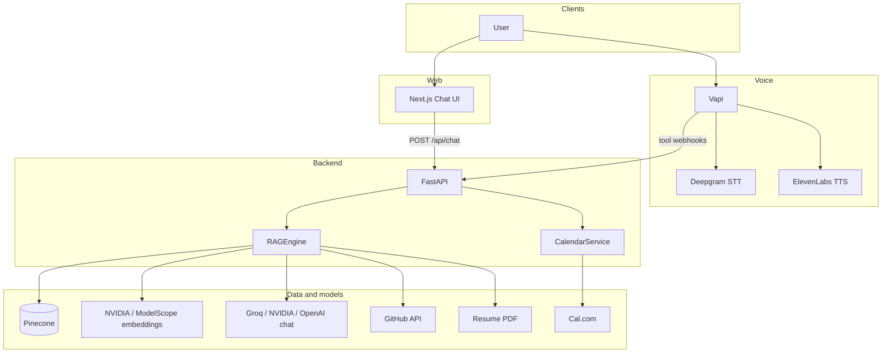
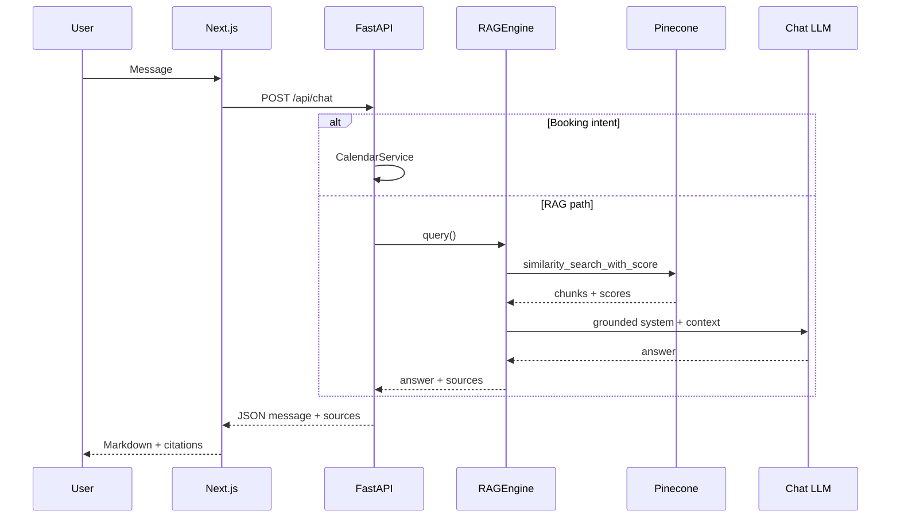
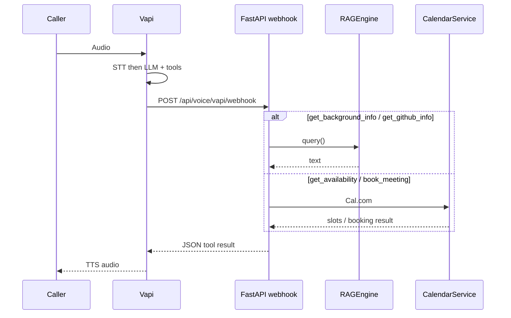

# Architecture

AI Persona is a **retrieval-augmented** assistant over your resume and GitHub, with **real calendar booking**, exposed through **web chat** (Next.js → FastAPI) and **phone voice** (Vapi orchestrating STT / LLM / TTS and tool calls to the same backend).

**Current deployment (from project env):** frontend on **Vercel**, API on **Railway**, vector store on **Pinecone**, voice on **Vapi**, calendar on **Cal.com**. Chat completion uses a **configurable provider chain** (typically **Groq → NVIDIA NIM → OpenAI** per `LLM_PROVIDER_ORDER`); embeddings use **NVIDIA NIM** (NeMo retriever, **2048-d**) into a matching Pinecone index when `NVIDIA_EMBEDDING_API_KEY` is set.

---

## System context (C4-style)



---

## LLM and embeddings (runtime)

| Layer | Typical setup | Notes |
|-------|----------------|-------|
| **Chat LLM** | Ordered chain via `LLM_PROVIDER_ORDER` | Defaults in code include Groq, NVIDIA NIM, ModelScope, OpenAI; timeouts in `LLM_REQUEST_TIMEOUT_SECONDS`. |
| **Embeddings** | NVIDIA NIM NeMo 300M (`nvidia/llama-3.2-nemoretriever-300m-embed-v1`) when `NVIDIA_EMBEDDING_API_KEY` is set | Output dimension **2048** — Pinecone index and `PINECONE_EMBEDDING_DIMENSION` must match. |
| **Fallback embeddings** | ModelScope / OpenAI-compatible | Used when NVIDIA embedding key is unset; dimension must match the active index (e.g. 4096 for some Qwen models). |

Re-ingest documents whenever you change embedding provider or dimension.

---

## Chat query lifecycle

**Sequence**



**ASCII overview**

```
User types message
        │
        ▼
Next.js frontend (useChat hook)
        │  POST /api/chat
        ▼
FastAPI chat route
        │
        ├─ Detect booking intent? ──YES──► CalendarService → availability context
        │
        ▼ NO
RAGEngine.query()
        │
        ├─ 1. similarity_search_with_score (Pinecone, top-k)
        ├─ 2. Filter by similarity threshold (default 0.70)
        ├─ 3. Optional fallback if nothing passes threshold
        ├─ 4. Format context string from retrieved chunks
        ├─ 5. Build system prompt (grounding prompt + context + history)
        └─ 6. LLM completion (provider chain) → answer
        │
        ▼
ChatResponse (message + sources + booking_link)
        │
        ▼
MessageBubble renders markdown + source citations
```

---

## Voice call lifecycle



**ASCII overview**

```
Phone rings Vapi number
        │
        ▼
Vapi STT (Deepgram nova-2) → transcript
        │
        ▼
LLM reasoning → decides to call a function
        │
        ▼
Vapi HTTP function-call → POST /api/voice/vapi/webhook
        │
        ├─ get_background_info → RAGEngine.query()
        ├─ get_availability   → CalendarService.get_availability()
        ├─ book_meeting        → CalendarService.create_booking()
        └─ get_github_info    → RAGEngine.query()
        │
        ▼
Result returned to Vapi as JSON
        │
        ▼
Vapi TTS (ElevenLabs) → audio played to caller
```

---

## Ingestion pipeline

```
resume.pdf  ──► pypdf extract ──► section splitter ──► RecursiveCharacterTextSplitter
                                                               │
GitHub API  ──► PyGithub fetch ──► README + metadata ─────────┤
                                   format_repo_for_embedding   │
                                                               ▼
                                                    Embedding API (NVIDIA NIM or ModelScope / OpenAI-compatible)
                                                               │
                                                               ▼
                                                    Pinecone serverless index
                                                    (cosine similarity; dimension matches embedding model, e.g. 2048)
```

---

## Infrastructure

| Component | Service | Notes |
|-----------|---------|-------|
| Backend API | Railway | e.g. `BACKEND_URL` in `.env` |
| Frontend | Vercel | e.g. `FRONTEND_URL` / `CHAT_URL` |
| Vector DB | Pinecone (serverless) | Index name + dimension must match embeddings |
| Voice | Vapi | SIP, STT, TTS; `BACKEND_URL` for webhooks |
| Calendar | Cal.com | API + `EVENT_TYPE_ID` |
| Embeddings | NVIDIA NIM (NeMo 300M) or ModelScope / other | See `backend/app/config.py` |
| Chat LLM | Groq / NVIDIA / OpenAI (chain) | `LLM_PROVIDER_ORDER` |
| TTS | ElevenLabs | Per Vapi config |
| STT | Deepgram nova-2 | Bundled via Vapi |

---

## Chunking strategy

- **Chunk size:** 512 characters
- **Overlap:** 50 characters
- **Splitter:** `RecursiveCharacterTextSplitter` (`\n\n → \n → . → " "`)
- **Resume:** split by section first (experience, education, etc.) then character-level within each section
- **GitHub:** one document per repo (README + metadata), then character-level split

---

## Similarity threshold and retrieval behavior

Retrieval uses cosine similarity scores from Pinecone. Chunks below `similarity_threshold` (default **0.70**) are filtered; if nothing passes, the pipeline can fall back to the strongest available matches so the model still receives context. GitHub “showcase” repos can be boosted; low-signal repos may be excluded via `persona_config`.

---

## Related docs

- [API Reference](API.md)
- [Setup](SETUP.md)
- Root [README](../README.md) for stack table and quick start
